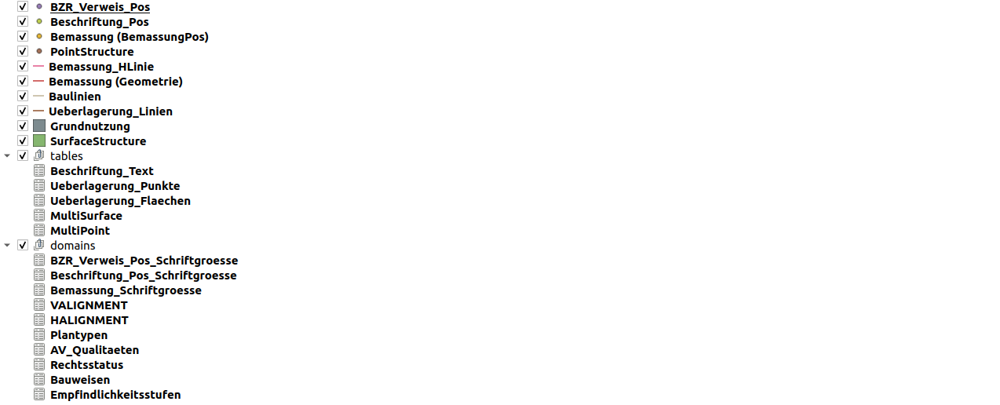
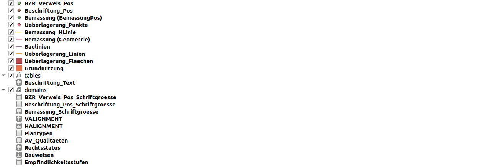
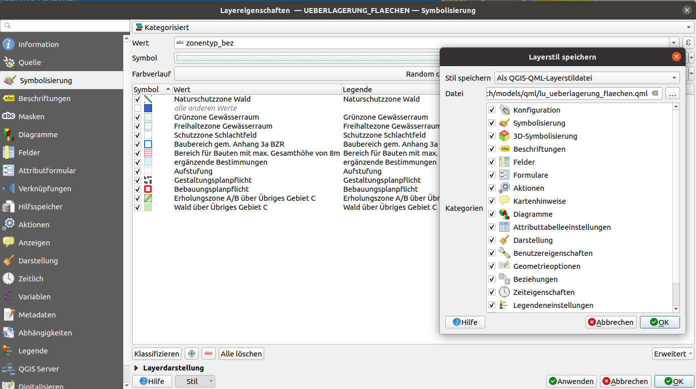

**Um eigene Toppings zu publizieren, muss man sie lokal erstellen und testen. Zukünftig sollen auch Tools einige Arbeitsschritte (wie zum Beispiel Layertree Export) übernehmen. Bis dahin sollen die folgenden Punkte ausgeführt werden, wie am Beispiel des Models Nutzungsplan Luzern**

## Realisierung Toppings für Nutzungsplanung_v310
Folgende Toppingfiles werden erstellt bzw. angepasst

- ilidata.xml (wird manuell angepasst)
- Metakonfigurationsfile (wird manuell erstellt)
- Layerkonfigurationen QML-Files (werden mit QGIS generiert)
- Layerreihenfolge und Legende YAML-File (wird manuell erstellt)
- Zur Projketerstellung benötigtes ili2db Metaattributfile TOML-File (wird manuell erstellt)


### 1. Vorbreitung
Es ist empfehlenswert, die Dateien in einem Verzeichnis abzulegen und folgende Unterverzeichnisse zu benennen:

```
.
├── ilidata.xml
├── layertree
├── metaconfig
├── qml
├── referencedata
├── sql
└── toml
```

#### Lokale Projektgenerierung
Dieser Ordner kann dann lokal im QGIS Model Baker getestet werden. `ilidata.xml` und `ilimodels.xml` werden darin gesucht und geparst.


Um auch die ILI Models lokal zu testen, soll man diese ebenfalls in den lokalen Ordner ablegen:
```
.
├── additional_local_ini_files
│   ├── CHBase_Part1_GEOMETRY_20110830.ili
│   ├── CHBase_Part2_LOCALISATION_20110830.ili
│   ├── CHBase_Part3_CATALOGUEOBJECTS_20110830.ili
│   ├── CHBase_Part4_ADMINISTRATIVEUNITS_20110830.ili
│   ├── CoordSys-20151124.ili
│   ├── Nutzungsplanung_V310.ili
│   └── Units-20120220.ili
```

Nun kann man das Projekt bereits lokal generieren:



Oder mit dem Metaattributfile für's *ili2db*:



Das Metaatributfile (TOML) wurde für das Projekt Nutzungsplan Luzern bereitserstellt. Dieses File wird im QGIS Model Baker unter “Advanced Options” und “Extra Model Information File” angegeben und wird zukünftig auch über den UsabILIty Hub eingebunden:


#### Projektkonfiguration

Im erstellten Projekt können nun Styles, Formulare, Layerstrukturen etc. konfiguriert werden, um diese Daten als Quelle für die Erstellung der Toppingfiles zu verwenden.

Besteht schon eine Umsetzung dieses Projekts, können diese Informationen aber auch daraus genommen werden.


### 2. Toppingfiles erstellen

#### 2. a. Layereigenschaften (QML Files)
Vom QGIS Projekt, mit bereits definierten Layereigenschaften werden zuerst die QML-Dateien gespeichert

"Layereigenschaften" > "Stil" > "Layerstil speichern"



In diesem Beispiel wurden die qml-Files so benannt, wie die Layers heissen mit prefix "lu_".

##### Problem mit Formularen im Falle Nutzungsplanung_V310 Originalprojekt

Das Originalprojekt beinhaltet nicht diesselbe Layernamen, wie das neu generierte Projekt. Dies kann einerseits der Fall sein, da es mit einer alten Model Baker Version erstellt worden ist oder weil die Layer später umbenannt worden sind. 
Bei den Formularkonfigurationen wurde so auf Layers referenziert, die nicht mehr existieren. Wenn diese Konfiguration nun über ein QML-File geladen wird, merkt das QGIS und lädt den benötigten Layer anhand dieser Information. Und dies führt dazu, dass Layer mehrfach ins Projekt geladen werden.

Um dem Vorzubeugen ist empfohlen, die QML Files testweise in das lokal generierte (neue) Projekt zu laden. Falls dieses (oder auch andere) Problem auftaucht, können nur einzelne Kategorien vom Originalprojekt verwendet werden. Im Falle Nutzungsplanung_V310, wurde so für gewisse Layer die Kategorie "Formulare" nicht aus dem Originalprojekt genommen, sondern im Layer des lokal generierten Projekts (der dem Originallayer bis auf die Formularkonfiguration enspricht), die Formulare manuell konfiguriert, und der Style erneut als QML abgespeichert.

#### 2. b. Layerreihenfolge und Legendenanordnung (YAML File)

In einem YAML File wird die Layerreihenfolge bzw. Legendenanordnung definiert.

Unter Haupteintrag `legend` wird die Legendenanordnung definiert und unter `layer-order` die Reihenfolge.

So sieht kann der Inhalt eines YAML-Files so aussehen:
```
legend:
  - "Geometrie-Layer":
      group: true
      expanded: true
      child-nodes:
        - "Punkt":
            featurecount: true
        - "Fläche":
        - "Linie":
            checked: true
  - "Informationen":
      group: true
      checked: true
      child-nodes:
        - "Unterhalt":
        - "Deponietypen":

layer-order:
  - "Punkt"
  - "Linie"
  - "Fläche"
```
Hierzu muss die korrekte Einrückugn und Struktur von [YAML](https://de.wikipedia.org/wiki/YAML) beachtet werden.

Definitionsmöglichkeiten sind:
- Layer/Gruppe sichtbar oder nicht: `checked: true`, wenn nicht: `checked: fals`.
- Legendeneintrag gilt als eine Gruppe, d.h. er hat weitere Einträge (child-nodes): `group: true`.
- Die Legendeneinträge in der Gruppe sind unter `child-nodes` aufgelistet.
- Untere Legendeneinträge (Children oder Symbolisierungskategorien) sichtbar/aufgeklappt sind: `expanded: true`.
- Die Sichtbarkeit der Layer in einer Gruppe schliessen sich gegenseitig aus `mutually-exclusive: true` (das heisst, nur ein Child ist sichtbar auf einmal)
- Die Anzahl der Features innerhalb eines Layers kann mit:`featurecount: true` angezeigt werden. 

Jeder Eintrag kann weitere “Childs” haben, so kann der “Layertree” beliebig viele Ebenen haben.


```
  - "SEMP_NP_PUNKTE":
      group: true
      checked: true
      expanded: true
      child-nodes:
        - "BZR_Verweis_Pos":
            checked: true
        - "Beschriftung_Pos":
            checked: true
        - "Bemassung (BemassungPos)":
            checked: true
            featurecount: true
        - "Ueberlagerung_Punkte":
            checked: true
            expanded: true
```

#### 2. c. Metaattributfile für ili2db (TOML)

Auch das TOML File kann als Topping verwendet werden. Dies ist im INI Format geschrieben und besteht bereits für das Nutzungsplanung_V310 Projekt:

Inhalt von `Nutzungsplanung_V310.toml`:
```
["Nutzungsplanung_V310.MultiPoint"]
ili2db.mapping=MultiPoint

["Nutzungsplanung_V310.MultiSurface"]
ili2db.mapping=MultiSurface
```

#### 2. d. Transferdateien (zBs. Kataloge) (XTF/ITF/XML)

Transferdateien wie zBs. Kataloge können ebenfalls als Topping verwendet werden. Im Projekt Nutzungsplanung_V310 wurden aber keine vorgegeben.
Für Infos über die Referenzierung der Transferdateien kann die Technische Dokumentation der Umsetzung im QGIS Model Baker eingesehen werden.

### 3. Ablage und Eintragen der Toppings im ilidata.xml

#### Ablage
Die Toppingfiles können nun in die für sie vorgesehenen Ordner abgelegt werden:
```
.
├── layertree
│   ├── layertree_Nutzungsplanung_V310.yaml
├── metaconfig
│   ├── lu_nutzungsplanung_v310.ini
├── qml
│   ├── lu_baulinien.qml
│   ├── lu_bemassung_geometrie.qml
│   ├── lu_bemassung_hlinie.qml
│   ├── lu_bemassung_pos.qml
│   ├── lu_beschriftung_pos.qml
│   ├── lu_beschriftung_text.qml
│   ├── lu_bzr_verweis_pos.qml
│   ├── lu_grundnutzung.qml
│   ├── lu_ueberlagerung_flaechen.qml
│   ├── lu_ueberlagerung_linien.qml
│   ├── lu_ueberlagerung_punkte.qml
└── toml
    ├── Nutzungsplanung_V310.toml

```

#### Eintragen ins ilidata.xml

Das *ilidata.xml* ist das "Register" über das die Toppingfiles gefunden werden.

Zur Struktur des auf dem [`DatasetIdx16`](http://models.interlis.ch/core/DatasetIdx16.ili) basierenden File, können die "Informationen über die technische Konzeption des UsabILIty Hubs" eingesehen werden.

Grundsätzlich muss eine Repository-übergreiffend eindeutige `id` vergeben werden. Sie muss nicht zwingend beschreibend für den Inhalt sein. Weiter muss der Typ des Toppings in den `categories` eingetragen werden, sowie der relative `path` zum betreffenden File.

Also wär der Eintrag für das Toppingfile "qml/lu_grundnutzung.qml" des Typs "qml" mit der Id "ch.lu.topping.Nutzungsplanung_V310_grundnutzung" der folgende:
```
      <DatasetIdx16.DataIndex.DatasetMetadata TID="3dcc47e5-1dd5-4f05-9fc8-756125705a2c">
        <id>ch.lu.topping.Nutzungsplanung_V310_grundnutzung</id>
        <version>2021-01-20</version>
        <owner>mailto:zsanett@opengis.ch</owner>
        <categories>
          <DatasetIdx16.Code_>
            <value>http://codes.interlis.ch/type/qml</value>
          </DatasetIdx16.Code_>
        </categories>
        <files>
          <DatasetIdx16.DataFile>
            <fileFormat>text/plain;version=2.3</fileFormat>
            <file>
              <DatasetIdx16.File>
                <path>qml/lu_grundnutzung.qml</path>
              </DatasetIdx16.File>
            </file>
          </DatasetIdx16.DataFile>
        </files>
      </DatasetIdx16.DataIndex.DatasetMetadata>
```

### 4. Die Metakonfiguration (INI)

Die Metakonfiguration ist das File, das alles zusammenhält. Mehr Informationen dazu gibt es ebenfalls im Dokument "Umsetzung im QGIS Model Baker". 

Für die Implementierung von Nutzungsplanung_V310 müssen nun die in den vorgängingen Steps erstellten Toppingfiles über ihre in *ilidata.xml* vergebene Id im Metakonfigurationsfile verlinkt sein. Die QML Toppigns, die Layerkonfigurationen enthalten, müssen den korrekten Namen der entsprechenden Layer zugewiesen werden.

```
[CONFIGURATION]
qgis.modelbaker.layertree=ilidata:ch.lu.topping.layertree_Nutzungsplanung_V310

[ch.ehi.ili2db]
iliMetaAttrs=ilidata:ch.lu.topping.npluzern_toml

[qgis.modelbaker.qml]
"BZR_Verweis_Pos"=ilidata:ch.lu.topping.Nutzungsplanung_V310_bzr_verweis_pos
"Beschriftung_Pos"=ilidata:ch.lu.topping.Nutzungsplanung_V310_beschriftung_pos
"Bemassung (BemassungPos)"=ilidata:ch.lu.topping.Nutzungsplanung_V310_bemassung_pos
"Ueberlagerung_Punkte"=ilidata:ch.lu.topping.Nutzungsplanung_V310_ueberlagerung_punkte
"Bemassung_HLinie"=ilidata:ch.lu.topping.Nutzungsplanung_V310_bemassung_hlinie
"Baulinien"=ilidata:ch.lu.topping.Nutzungsplanung_V310_baulinien
"Ueberlagerung_Linien"=ilidata:ch.lu.topping.Nutzungsplanung_V310_ueberlagerung_linien
"Grundnutzung"=ilidata:ch.lu.topping.Nutzungsplanung_V310_grundnutzung
"Bemassung (Geometrie)"=ilidata:ch.lu.topping.Nutzungsplanung_V310_bemassung_geometrie
"Ueberlagerung_Flaechen"=ilidata:ch.lu.topping.Nutzungsplanung_V310_ueberlagerung_flaechen
"Beschriftung_Text"=ilidata:ch.lu.topping.Nutzungsplanung_V310_beschriftung_text
```

#### Eintragen ins ilidata.xml

Auch die Metakonfigurationsdatei muss ins *ilidata.xml* eingetragen werden. Nur so kann sie von Tools wie dem Model Baker gefunden werden.

Grundsätzlich genau gleich wie ein Toppingfile. Eine Repository-übergreiffend eindeutige `id`, der Typ in den `categories` sowie der relative `path` zum betreffenden File. 
```
      <DatasetIdx16.DataIndex.DatasetMetadata TID="a2acb2f5-38bd-4d1a-8af0-c2463dcb5b66">
        <id>ch.opengis.ili.config.Nutzungsplanung_V310</id>
        <version>2021-03-12</version>
        <owner>mailto:zsanett@opengis.ch</owner>
        <categories>
          <DatasetIdx16.Code_>
          	<value>http://codes.interlis.ch/type/metaconfig</value>
          </DatasetIdx16.Code_>
        </categories>
        <files>
          <DatasetIdx16.DataFile>
            <fileFormat>text/plain;version=2.3</fileFormat>
            <file>
              <DatasetIdx16.File>
                <path>metaconfig/lu_nutzungsplanung_v310.ini</path>
              </DatasetIdx16.File>
            </file>
          </DatasetIdx16.DataFile>
        </files>
      </DatasetIdx16.DataIndex.DatasetMetadata>
```

Damit das Metakonfigurationsfile aber aufgrund eines Modellnamens (hier "Nutzungsplanung_V310") gefunden wird, muss dieser ebenfalls in den `categories` eingetragen werden. Zusätzlich braucht es einen `title`, damit es im GUI des Model Bakers zu erkennen ist. Die `shortDescription` ist optional und dient zur weiteren Beschreibung des Inhalts der Metaknofiguration. So sieht der Eintrag schlussendlich so aus:

```
      <DatasetIdx16.DataIndex.DatasetMetadata TID="a2acb2f5-38bd-4d1a-8af0-c2463dcb5b66">
        <id>ch.opengis.ili.config.Nutzungsplanung_V310</id>
        <version>2021-03-12</version>
        <owner>mailto:zsanett@opengis.ch</owner>
        <title>
          <DatasetIdx16.MultilingualText>
            <LocalisedText>
              <DatasetIdx16.LocalisedText>
                <Language>de</Language>
                <Text>Styling und Tree für PostgreSQL Projekt für den Kanton Luzern (lu.ch)</Text>
              </DatasetIdx16.LocalisedText>
            </LocalisedText>
          </DatasetIdx16.MultilingualText>
        </title>
        <shortDescription>
          <DatasetIdx16.MultilingualMText>
            <LocalisedText>
              <DatasetIdx16.LocalisedMText>
                <Language>de</Language>
                <Text>Die Metakonfiguration für ein PostgreSQL Projekt generiert mit dem Model Nutzungsplan_V310 enthält Links zu Layertree Struktur, TOML und QML Files.</Text>
              </DatasetIdx16.LocalisedMText>
            </LocalisedText>
          </DatasetIdx16.MultilingualMText>
        </shortDescription>
        <categories>
          <DatasetIdx16.Code_>
          	<value>http://codes.interlis.ch/model/Nutzungsplanung_V310</value>
          </DatasetIdx16.Code_>
          <DatasetIdx16.Code_>
          	<value>http://codes.interlis.ch/type/metaconfig</value>
          </DatasetIdx16.Code_>
        </categories>
        <files>
          <DatasetIdx16.DataFile>
            <fileFormat>text/plain;version=2.3</fileFormat>
            <file>
              <DatasetIdx16.File>
                <path>metaconfig/lu_nutzungsplanung_v310.ini</path>
              </DatasetIdx16.File>
            </file>
          </DatasetIdx16.DataFile>
        </files>
      </DatasetIdx16.DataIndex.DatasetMetadata>
```

 

 